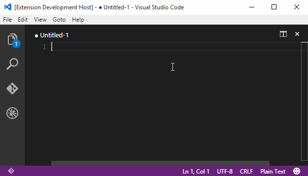

A tiny VS Code extension made up of a few commands that generate and insert lorem ipsum text into a text file.

To use the extension, open the command palette (<kbd>F1</kbd> or <kbd>cmd/ctrl+shift+p</kbd>, type "lorem ipsum" and select to insert either a line or paragraph.



## Customization

The following commands are added:

- `lorem-ipsum.line`
- `lorem-ipsum.paragraph`
- `lorem-ipsum.multipleParagraphs`

By default they don't have keybindings, but [you can add a custom keybinding](https://code.visualstudio.com/docs/getstarted/keybindings#_advanced-customization). For example:

```json
{
  "key": "ctrl+shift+l",
  "command": "lorem-ipsum.paragraph",
  "when": "editorTextFocus"
}
```

## Credits

- The core functionality is provided by the [lorem-ipsum npm package](https://www.npmjs.com/package/lorem-ipsum)
