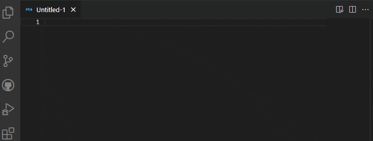

# Functionality

Generates and inserts lorem ipsum text into Visual Studio Code.

# Install

1. Open VS Code
2. Press F1
3. Type "install"
4. Select "Extensions: Install Extension".
5. Select Lorem ipsum from the list

# Usage

Press F1 type lorem ipsum and select to insert either a line or paragraph.

